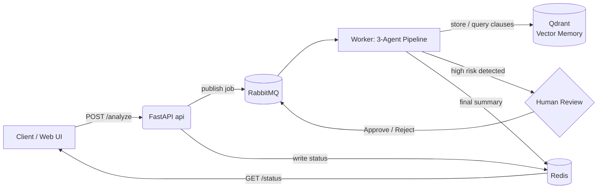

# Agentic Contract Analyzer

**Live demo:** https://agentic-contract-analyzer-api.onrender.com
*(free-tier hosting — first request may take ~30-50s to wake the service up)*

A fully free, multi-agent AI system that analyzes legal contracts end-to-end: extracts key clauses, assesses risk, pauses for human review on high-risk findings, and produces a plain-language summary — with long-term memory and full observability. Runs locally with Docker, and is also deployed live on free-tier cloud infrastructure.

Built as a hands-on exploration of agentic AI architecture: message queues, human-in-the-loop workflows, vector memory, and distributed tracing.

## Agent flow

```
Upload contract (PDF/TXT)
   --> Clause Extractor Agent      (pulls obligations, payment terms, termination conditions)
   --> Risk Analyzer Agent         (scores each clause low / medium / high, using vector memory for consistency)
   --> [if any clause is high risk] Human Review Checkpoint (Approve / Reject)
   --> Summarizer Agent            (plain-language summary + key risks)
   --> Stored in Qdrant            (long-term memory for future contracts)
```

## Example: real analysis output

Input: a synthetic software services agreement (Client/Provider, $180,000 contract value).

The Risk Analyzer flagged 4 high-risk clauses and 2 medium-risk clauses, including:

- **High risk** — Provider can terminate at any time, without cause and without refunding fees already paid.
- **High risk** — Client must indemnify and hold harmless the Provider against any third-party claims, creating broad financial exposure.
- **High risk** — Client is barred from working with any similar firm in the same market for 24 months after the contract ends.
- **Medium risk** — Automatic renewal could extend the agreement unintentionally if the 90-day notice window is missed.

After human approval, the Summarizer Agent produced:

> "Northgate Retail Holdings LLC (the Client) hires Brightline Software Solutions FZ-LLC (the Provider) to design, develop, test, and deliver a customer-loyalty mobile app over a 12-month period... The Provider can terminate the agreement at any time, without cause and without refunding fees already paid. The Client must indemnify and defend the Provider against any third-party claims related to the agreement..."

## How it works

1. **Clause Extractor Agent** — pulls parties, duration, obligations, termination conditions, and payment terms out of the raw contract text (PDF or TXT).
2. **Risk Analyzer Agent** — rates each clause `low` / `medium` / `high` risk, using similar clauses from previously analyzed contracts (via vector search) as extra context for consistency.
3. **Human-in-the-Loop checkpoint** — if any clause is rated `high` risk, the pipeline pauses and waits for a human decision (approve/reject) before continuing.
4. **Summarizer Agent** — once approved, produces a plain-language summary of the contract and its key risks.
5. **Long-term memory** — every completed analysis is stored in a vector database, so future contracts benefit from precedent.

All three agents run on Groq's free LLM API.

## Architecture

- The user uploads a contract through the web UI, which sends it to the FastAPI `api` service (`POST /analyze`).
- `api` publishes a job to a RabbitMQ queue and writes the job status to Redis.
- The `worker` service consumes the queue and runs the 3-agent pipeline, updating job status in Redis as it goes.
- If a clause is high risk, the worker pauses and waits on a second RabbitMQ queue for a human decision, submitted via `POST /jobs/{id}/decision`.
- Completed analyses are stored in Qdrant (vector memory) for future reference.
- Every step in both `api` and `worker` is traced with OpenTelemetry and visualized in Jaeger — this tracing is what surfaced a cold-start bottleneck adding 80%+ latency to one pipeline stage, which was then fixed.

### Architecture diagram



## Tech stack

- **API**: FastAPI, served with a static HTML/JS frontend (no framework, no build step)
- **Messaging**: RabbitMQ (raw `pika`, two queues — one for new contracts, one for human decisions)
- **Shared state**: Redis (job status, since the API and worker are separate processes)
- **LLM**: Groq (`openai/gpt-oss-120b`) — free tier
- **Vector memory**: Qdrant + `fastembed` (local embeddings, no API key needed)
- **Observability**: OpenTelemetry + Jaeger (local full distributed tracing across every pipeline stage)
- **Infra**: Docker Compose locally (6 services); Render + CloudAMQP + Upstash Redis + Qdrant Cloud for the live deployment — same codebase, driven entirely by environment variables

## Features

- Upload a contract as PDF or TXT
- Automatic clause extraction and risk scoring
- Human-in-the-loop approval gate for high-risk contracts
- Long-term memory — the system gets more consistent over time as it sees more contracts
- Full request tracing (Jaeger, local mode) showing exactly how long each agent step took
- Simple web UI — no need to touch Swagger/API docs to use it
- Live, publicly deployed version running entirely on free-tier cloud services

## Running locally

Requirements: Docker Desktop, a free Groq API key (console.groq.com).

```bash
git clone https://github.com/SSSA335/agentic-contract-analyzer.git
cd agentic-contract-analyzer

# create a .env file with:
# GROQ_API_KEY=your_key_here

docker compose up --build
```

Then open:

- **App UI**: http://localhost:8000
- **Jaeger tracing UI**: http://localhost:16686
- **RabbitMQ management**: http://localhost:15672 (guest/guest)

## Live deployment

The same codebase runs on free-tier cloud infrastructure, with connection details supplied entirely via environment variables (no code changes needed between local and cloud):

- **API + Worker**: Render (2 free web services — the worker exposes a lightweight health endpoint alongside its RabbitMQ consumer, so it satisfies Render's port-binding requirement on the free tier)
- **Message queue**: CloudAMQP (RabbitMQ)
- **Shared state**: Upstash (Redis)
- **Vector memory**: Qdrant Cloud

## Project structure

- `api/` — FastAPI app: upload endpoint, job status, decision endpoint, static UI
  - `api/static/` — Frontend (index.html)
- `worker/` — Consumes RabbitMQ queues, runs the 3-agent pipeline
  - `worker/agents.py` — Clause Extractor / Risk Analyzer / Summarizer prompts + Groq calls
  - `worker/memory.py` — Qdrant vector storage + similarity search
  - `worker/tasks.py` — Queue consumers, OpenTelemetry spans, health endpoint
- `docker-compose.yml` — defines all 6 local services

## License

MIT — see [LICENSE](LICENSE).

## Notes

This is a personal learning project exploring agentic AI patterns — it is not production-hardened (no auth, no persistence beyond local volumes/free-tier storage limits, in-memory job store via Redis without expiry). Contract samples used for testing are synthetic and for demonstration only. The live deployment runs on free tiers, so the first request after inactivity may take 30-50 seconds while the services wake up.
